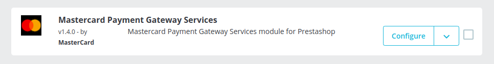
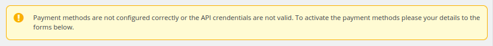
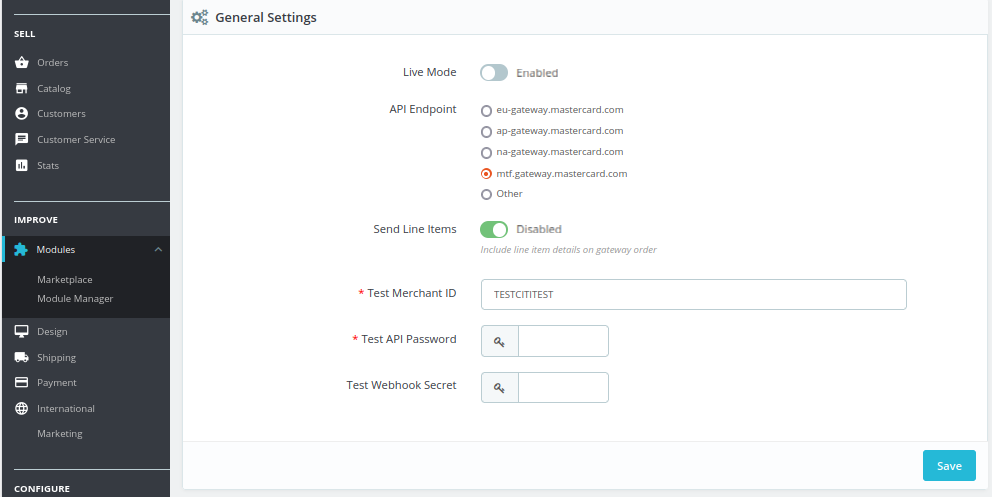
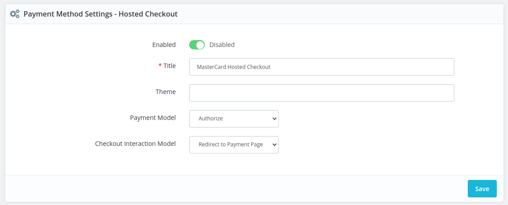
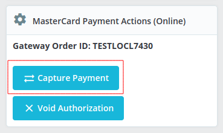
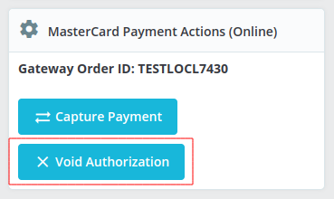
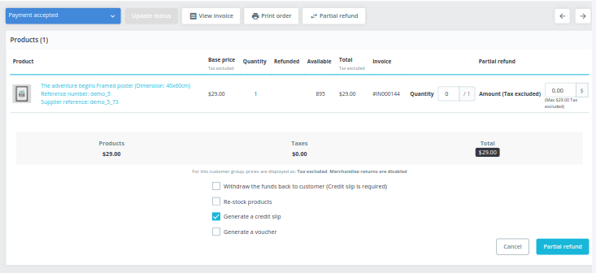
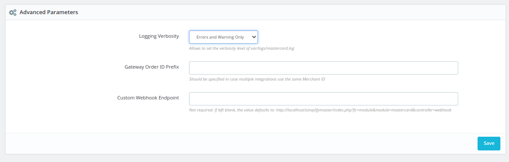

# Mastercard Payment Gateway Services module for PrestaShop

This plugin is a payment option on your PrestaShop checkout page.

## System Requirements

The latest release of the plugin has the following system requirements:

- PHP version 8.1 or higher is mandatory.
- PrestaShop version 8.0.4 or later is required. However, we strongly recommend using the latest available version of PrestaShop for optimal performance.

## Documentation

The official documentation for this module is available on: https://mpgs.fingent.wiki/target/prestashop-mastercard-payment-gateway-services

## Support

For customer support: https://mpgsfgs.atlassian.net/servicedesk/customer/portals

## Compatibility

Versions v1.3.5
- Add support for the "Enforce Unique Order Reference" and "Enforce Unique Merchant Transaction Reference" gateway features.
- Add 3DS2 support.

Versions v1.3.7
- The refund is failing if the Gateway Order ID Prefix field is longer than 41.
- It's impossible to void authorised transaction on newest versions of PrestaShop.
- Admin is redirected to the Order Listing instead of the Order View page after actions produced by the module.

Version v1.3.8
- The products are removed from the customer's shopping cart if the payment fails.

Version v1.4.0
- Enhanced Compatibility: Compatible with PHP 8.1 & PrestaShop 8.0.x (tested with v8.0.4).
- The module has been updated to API version 73.
- Added the Checkout Interaction Model feature to the admin settings.
- Hosted session payment method is no longer supported.

## Feature Support

PrestaShop Mastercard Payment Gateway Service module supports the following list of features:

- Card payments
- Hosted Checkout
- Capture Payment
- Void Transaction
- Full refund
- Partial refund

## Installation

1. Make a backup of your site before applying new mods etc.
2. Download the .zip file of the latest release of the extension from https://github.com/Mastercard-Gateway/gateway-prestashop-module/releases
3. Go to Admin → Modules → Module Manager → Upload a Module and upload the downloaded .zip file.
4. After uploading the PrestaShop Module, click the Configure button.

## Configuration

### General Settings

Once you have the Mastercard Payment Gateway Service module installed, you can configure the module from the admin panel.

Find the relevant Configure button under your Module Manager:

Firstly, it’s important to configure your gateway credentials in TEST mode and make sure that everything works.

Note: that if gateway credentials are not configured correctly, you can not enable any of the modules payment methods.

If the gateway credentials are incorrect for any reason, there will be a warning displayed at the top of the configuration page.

The General Settings view:

| Name | Description |
|--|--|
| Live Mode | Yes/No. Toggles between Test and Live mode. Both modes have their own set of credential fields which you need to fill separately. It gives you the ability to switch between modes without re-entering your credentials every time. |
| API Endpoint | The API endpoint should be selected based on your account region.|
|Send Line Items |Yes/No. This setting allows you to choose if you want shopping cart data to be sent to the gateway, this includes product information, grand total, etc. |
|Test Merchant ID / Merchant ID |Your merchant ID. |
|Test API Password / API Password | Your merchant API password.|
|Test Webhook Secret / Webhook Secret | If webhook support is enabled, then enter your webhook secret here.|

## Hosted Checkout Integration

The Hosted Checkout model allows you to collect payment details from your payer through a payment page by the payment gateway. You never see or handle payment details directly because these are collected by the hosted payment interface and submitted directly from the payer's browser to the payment gateway.

Below are list of Hosted Checkout method configurations which you will find in the administration interface:

|Name|Description  |
|--|--|
|Enabled | Two Options are available:   **YES** - to enable this payment method for Mastercard Payment Gateway Module   **NO** - to disable this payment method |
|Title |Text mentioned here will be appear on front-end checkout page / payment method section. |
|Theme| Leave blank unless indicated by your payment provider. |
|Payment Model|Select any One option from below:  **Purchase**  - Fund will be transferred to merchant account as soon as user’s entered card details has been successfully verified and order is placed.  **Authorize**  - 2 stage process; where once order will place, it will only authorize user’s card details. Payment amount need to be captured manually by merchant. |
|Checkout Interaction Model |Select any One option from below:  **Embedded**  - Show a hosted payment form embedded into the merchant site.   **Hosted Payment Page**  - Redirect to a hosted payment page to complete the payment.|

## Back-office Operations
If Authorize payment method has been selected, then Funds need to be captured or refunded manually.

### To Capture Funds

Capture Payment is used for processing transactions and transferring funds into the merchant’s account.

- Under the Order detail page, when clicking on the “Capture Payment” button it will process transactions and the amount of the order will be transferred to the merchant's account.
- After clicking on the “Capture Payment” button, the gateway will capture the transaction and then you will see a success message. The order status will also change to “Payment Accept”.

### Void Transaction

Void Transaction is used to cancel the order. By clicking on the “Void Transaction” button, the order will be canceled automatically and the amount of the order will be credited to the user’s card (if payment has been captured).

### Refund Payment

Once Payment has been captured by the merchant using the Capture Payment option, the merchant may be later required to refund the payment.

#### Full Refund

- Select the Order for which payment has been captured and now the amount needs to be refunded to the user.

- Goto that order detail page.

- Check the Mastercard Payment Action (Online) tab.

- Here, the Full Refund button will be found from where the merchant can refund the full amount captured for that order.  

- On clicking on the Full Refund button, the amount will be refunded to the user.

- To Restock the ordered product, you will need to do the process of creating PrestaShop Refund on top of Mastercard Payment Gateway module refund process

#### Partial Refund

- Select the Order for which payment has been captured and now the amount needs to be refunded to the user.

- Goto that order detail page.

- Here, the Partial Refund button will be found from where the merchant can refund the amount captured for that order.  

- On clicking on the Partial Refund button, the partial amount can be refunded to the user.

## Advanced Configurations

Below is the list of advanced configurations for the Mastercard Payment Gateway Service module.

|Name|Description  |
|--|--|
| Logging Verbosity | This module logs data into var/logs/mastercard.log - this switch control how much data is being logged,   Select any One option from below: **Errors Only**  - this is default option, which only logs when an error happens. **Everything**  - Logs everything related to error when it occurs (Like: API Response/status, errors, warning, etc). **Errors and Warning Only**  - Logs only errors and warnings when error occured. **Disabled**  - by selecting this, nothing will be logged when error will occured. |
|Gateway Order ID Prefix |**Default Option**: Blank In case one Merchant ID is used by multiple installation, then this field can be used to add a prefix to order id-s so that they will not conflict in the gateway. |
|Custom Webhook Endpoint |**Default Option**: Blank This field is mostly only used by development or with some complex web server rules, where the URL is not automatically detected correctly. |

It is suggested to keep these fields with assigned default values. Please first consult with the Technical team / Mastercard Payment Gateway Module support before changing these settings.