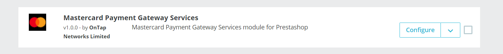
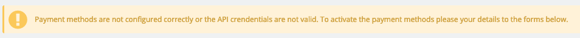
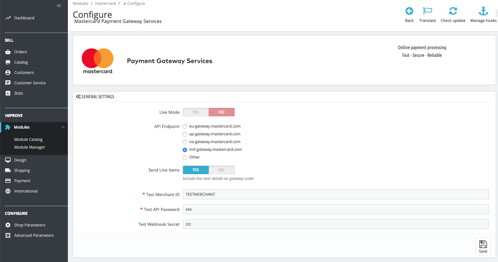
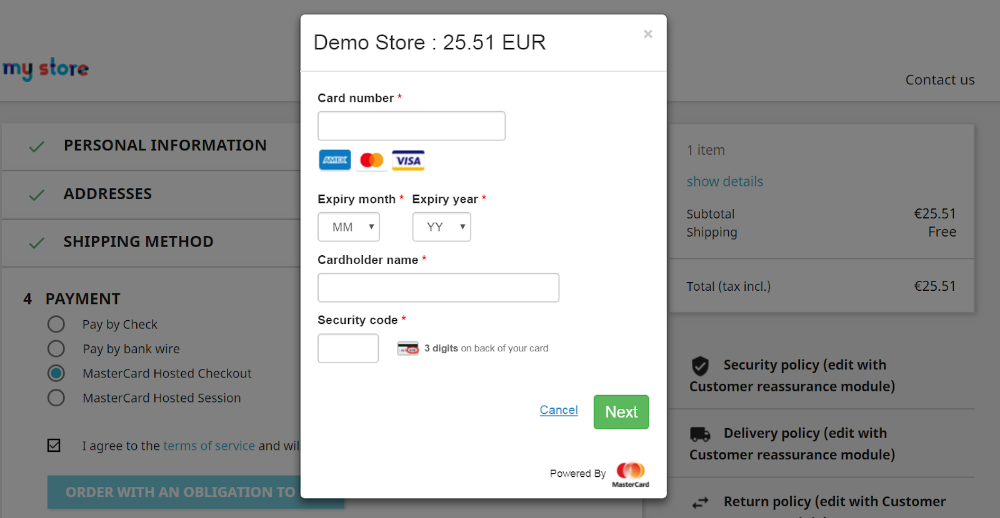
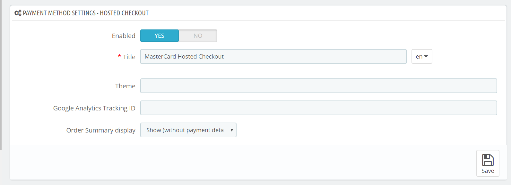
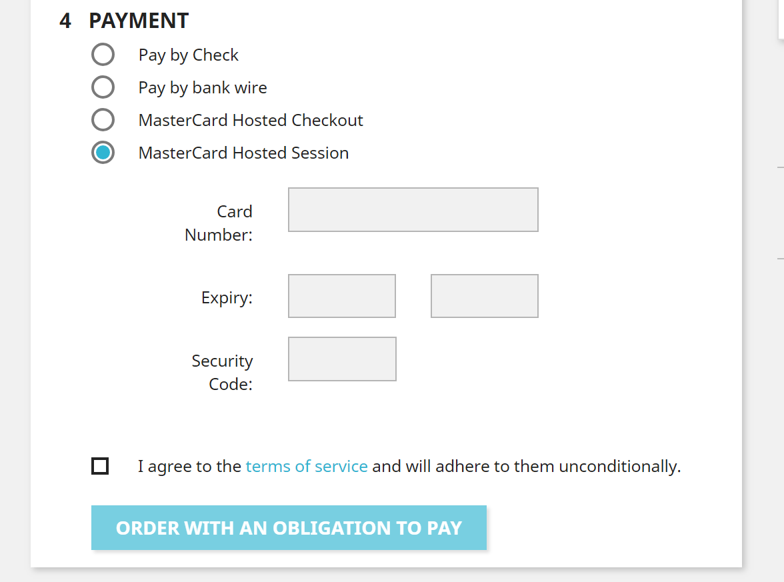
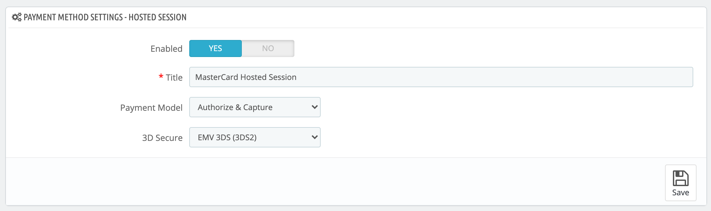
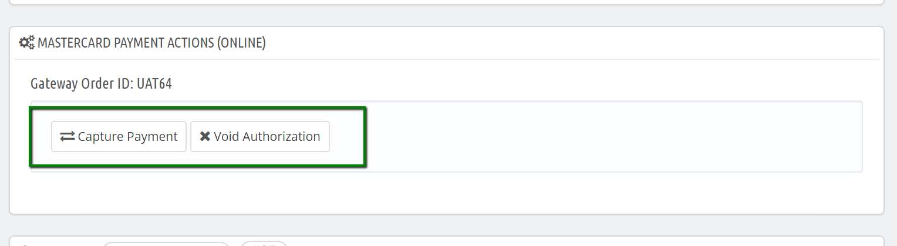
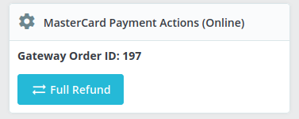
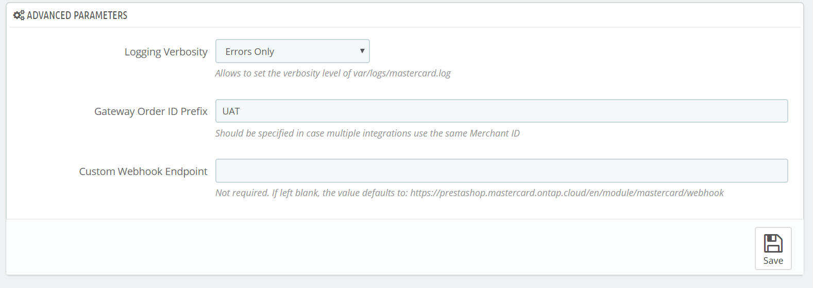

# Mastercard Payment Gateway Services module for PrestaShop

## Installation in PrestaShop
You can obtain the module by downloading a release from: [https://github.com/Mastercard-Gateway/gateway-prestashop-module/releases](https://github.com/Mastercard-Gateway/gateway-prestashop-module/releases) - the module is licensed using  [OSL 3.0](https://opensource.org/licenses/OSL-3.0).

The module has been tested with the PrestaShop versions
- 1.7.4.4
- 1.7.5.0, 

and with PHP versions
- 7.1
- 7.2.

Please refer to official Prestashop documentation for general installation guidelines  
[https://addons.prestashop.com/en/content/13-installing-modules](https://addons.prestashop.com/en/content/13-installing-modules)

## General settings

Once you have Mastercard Payment Gateway Service module installed you can configure module from admin panel.

Find the relevant Configure button under your Module Manager:

Firstly, it’s important to configure your Merchant credentials in TEST mode and make sure that everything works.

Note: that if merchant credentials are not configured correctly, you can not enable any of the modules payment methods.

If the credentials are incorrect for any reason, there will be a warning displayed on the top of the configuration page.

  
The General Settings view:

| Name | Description |
|--|--|
| Live Mode | Yes/No. Toggles between Test and Live mode. Both modes have their own set of credential fields which you need to fill separately. It gives you the ability to switch between modes without re-entering your credentials every time. |
| API Endpoint | The API endpoint should be selected based on your account region.|
|Send Line Items |Yes/No. This setting allows you to choose if you want shopping cart data to be sent to MasterCard, this includes product information, grand total, etc. |
|Test Merchant ID / Merchant ID |Your merchant ID. |
|Test API Password / API Password | Your merchant API password.|
|Test Webhook Secret / Webhook Secret | If webhook support is enabled, then enter your webhook secret here.|

## Hosted Checkout integration

The Hosted Checkout model allows you to collect payment details from your payer through an interaction hosted and displayed by the Mastercard Payment Gateway. With this model of integration, you never see or handle payment details directly because these are collected by the hosted payment interface and submitted directly from the payer's browser to the Mastercard Payment Gateway.

If Hosted Checkout is integrated and enabled for Mastercard Payment Gateway module, then once user will enter required card details on popup and click on submit order, then upon successfully authorization of entered card details, funds will be deducted from user’s account and will be automatically transferred to merchant/seller’s account. It may take some time to get funds credited but this process will be automatic.

Below are list of Hosted Checkout method configuration which you will find in admin:

|Name|Description  |
|--|--|
|Enabled | Two Options are available:   **YES** - to enable this payment method for Mastercard Payment Gateway Module   **NO** - to disable this payment method |
|Title |Text mentioned here will be appear on front-end checkout page / payment method section. |
| Theme|Effect of entered theme name will apply on Mastercard Payment Gateway popup on which user will enter their card details. |
|Google Analytics Tracking ID |If Analytics tracking ID will be included, then all the order placed using MPGS payment option will be tracked and records will be updated under that Google Analytics account. |
|Order Summary display |Select any One option from below:  **Hide**  - to not display any order and card details to user before submitting order   **Show**  - to display order and entered card details to user before submitting order   **Show (without payment details)**  - to display only order details to user before submitting order |

## Hosted Session integration
Choose the Hosted Session model if you want control over the layout and styling of your payment page, while reducing PCI compliance costs. The Hosted Session JavaScript client library enables you to collect sensitive payment details from the payer in payment form fields, sourced from and controlled by Mastercard Payment Gateway. The gateway collects the payment details in a payment session and temporarily stores them for later use. You can then include a payment session in place of payment details in the transaction request to process a payment.

There are two different payment flow methods under Hosted session integration:

1.  **Purchase (Pay)**  
    If Purchase has been selected for Payment Model, then transaction will be done automatically. After user has entered card detail and submit order, amount of total order will be deducted from user’s card and will be automatically transferred to merchant’s account. It may take some time for reflecting amount into merchant’s account, but the process will be automatic.
2.  **Authorize & Capture**  
    If Authorize & Capture has been selected for Payment Model, then merchant will have to manually process transactions and accept payment amount. Manually process of capturing funds can be done via Prestashop Admin as well as Merchant’s Mastercard Payment Gateway account login.

Below is list of all configuration options you will see under Hosted Session payment method for Mastercard Payment Gateway service Module:

|Name|Description|
|--|--|
| Enabled | Two Options are available:  **YES**  - to enable this payment method for Mastercard Payment Gateway Module  **NO**  - to disable this payment method |
|Title|Text mentioned here will be appear on front-end checkout page / payment method section|
|Payment Model|Select any One option from below:  **Purchase**  - Fund will be transferred to merchant account as soon as user’s entered card details has been successfully verified and order is placed.  **Authorize & Capture**  - 2 stage process; where once order will place, it will only authorize user’s card details. Payment amount need to be captured manually by merchant. |
|3D Secure |Two Options are available:   **YES**  - to add extra layer of security for completing order process. After user will enter card details, it will redirect to user's bank payment gateway for verification.   **NO**  - After placing order and entered card details has been verified, the order will be placed. No extra layer of security will be there. |

## Back-office Operations
If Hosted Session has been integrated for Mastercard Payment Gateway Service module and Authorize & Capture payment method has been selected, then Funds need to be captured or refund manually.

### To Capture Funds

Capture Payment is used for processing transaction and getting order funds into merchant’s account.

-   Under Order detail page, when clicking on “Capture Payment” button it will process transactions and amount of order will be transferred to merchant's account.
-   After clicking on “Capture Payment”, page will be load and you will get success message Also, Order status will be changed to “Payment Accept”.

### Void Transaction

Void Transaction is used to cancel order if merchant finds any fraud/suspect in that order. By clicking on “Void Transaction” button, order will be cancelled automatically and amount of order will be credited to user’s card (if payment has been captured).

### Refund Payment

Once Payment has been captured by merchant using Capture Payment option, then for that Order, merchant will find option to refund payment.

-   Select Order for which payment has been captured and now amount needs to be refunded to user.
    
-   Goto that order detail page.
    
-   Check Mastercard Payment Action (Online) tab.
    
-   Here, Full Refund button will be find from where merchant can refund full amount captured for that order.  
    
    
-   On clicking on Full Refund button, amount will be refunded to user.
    
-   To Restock ordered product, you will need to do process of creating Prestashop Refund on top of Mastercard Payment Gateway module refund process

## Advanced Configurations
Below are list of advanced configurations which you will find under Mastercard Payment Gateway Service Module.

|Name|Description  |
|--|--|
| Logging Verbosity | This module logs data into var/logs/mastercard.log - this switch control how much data is being logged,   Select any One option from below: **Errors Only**  - this is default option, which only logs when an error happens. **Everything**  - Logs everything related to error when it occurs (Like: API Response/status, errors, warning, etc). **Errors and Warning Only**  - Logs only errors and warnings when error occured. **Disabled**  - by selecting this, nothing will be logged when error will occured. |
|Gateway Order ID Prefix |**Default Option**: Blank In case one Merchant ID is used by multiple installation, then this field can be used to add a prefix to order id-s so that they will not conflict in the gateway. |
|Custom Webhook Endpoint |**Default Option**: Blank This field is mostly only used by development or with some complex web server rules, where the URL is not automatically detected correctly. |

It is suggested to keep these fields with assigned default value. If required, then do required configuration changes based on your need but first consult with Technical team / Mastercard Payment Gateway Module support for these.
